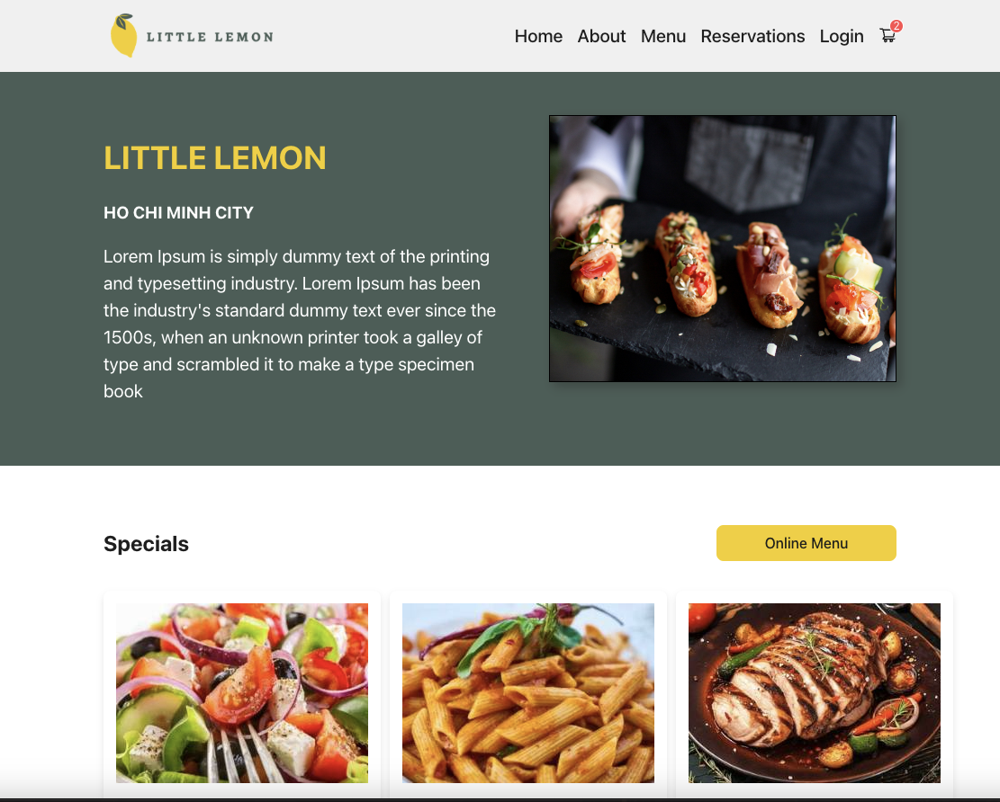
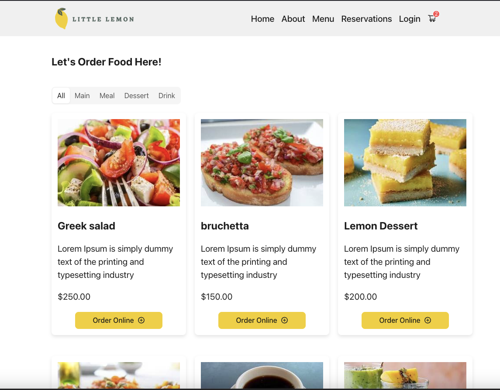
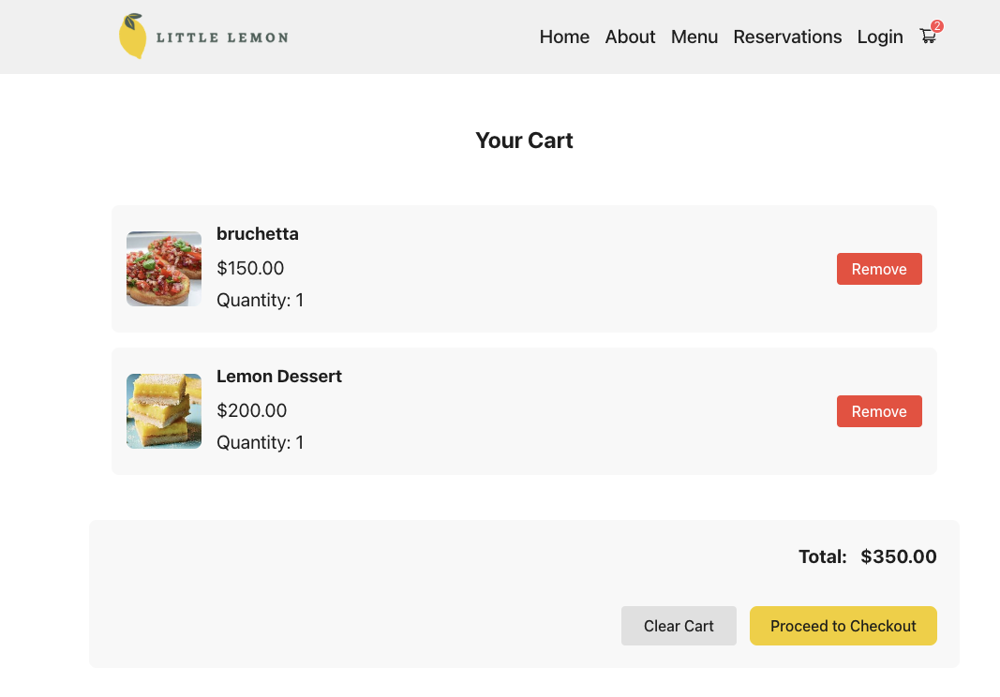
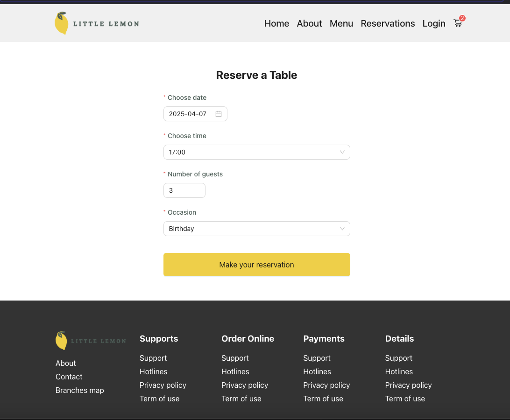

# Little Lemon Restaurant - Meta Front-End Developer Capstone

This project is the capstone for the Meta Front-End Developer certification, implementing the Little Lemon restaurant website with modern React and Vite.

## 🍋 About The Project

Little Lemon is a Mediterranean restaurant website featuring online menu browsing, table reservations, and food ordering capabilities. This project demonstrates front-end development skills using React, focusing on component architecture, responsive design, and modern JavaScript practices.

## ✨ Features

- **Home Page**: Introduction to the restaurant with featured menu items
- **Menu Page**: Browse menu with category filtering (Main, Meal, Drink)
- **Booking System**: Reserve tables with date/time selection
- **Cart Functionality**: Add items to cart and manage orders
- **Responsive Design**: Mobile-first approach with breakpoints at 480px and 768px

## 🛠️ Tech Stack

- **React 18** - UI Library
- **Vite** - Build tool and development server
- **React Router v6** - Navigation and routing
- **Ant Design** - UI Component library
- **CSS Modules** - Component-scoped styling
- **Vitest** - Testing framework
- **React Testing Library** - Component testing

### Preview screenshots

- Home page
  

- Menu page
  

- Cart & Booking pages
  
  

- Tablet
  

- Mobile
  

## 🚀 Getting Started

### Prerequisites

- Node.js (v16+)
- pnpm (recommended) or npm

### Installation

1. Clone the repository

   ```sh
   git clone https://github.com/yourusername/meta-front-end-developer-capstone.git
   cd meta-front-end-developer-capstone
   ```

2. Install dependencies

   ```sh
   pnpm install
   ```

3. Start the development server

   ```sh
   pnpm dev
   ```

4. Open http://localhost:5173 to view the app in your browser

## 🧪 Testing

Run tests with:

```sh
pnpm test           # Run all tests
pnpm test:watch     # Run tests in watch mode
pnpm test:coverage  # Run tests with coverage report
pnpm test:ui        # Run tests with UI
```

## 📝 License

This project is part of the Meta Front-End Developer certification.

## 🙏 Acknowledgments

- Meta Front-End Developer Professional Certificate program
- Little Lemon restaurant design system
